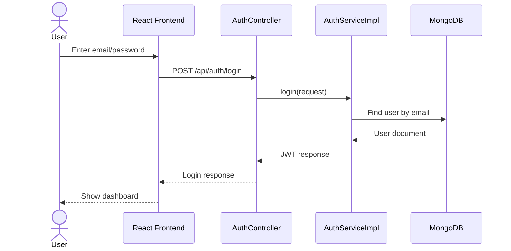
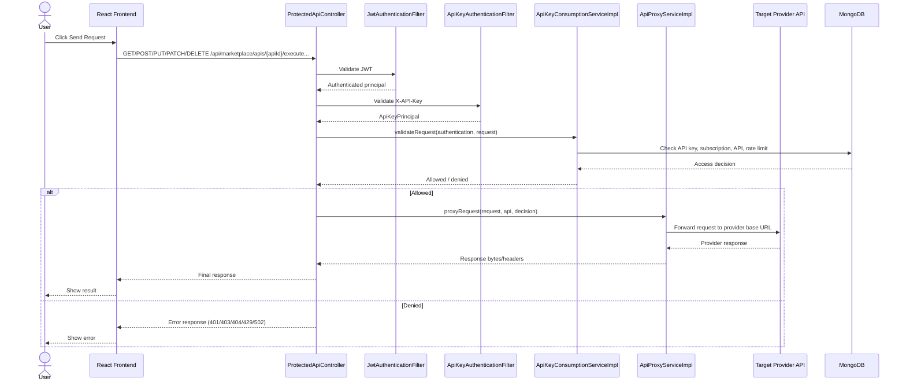
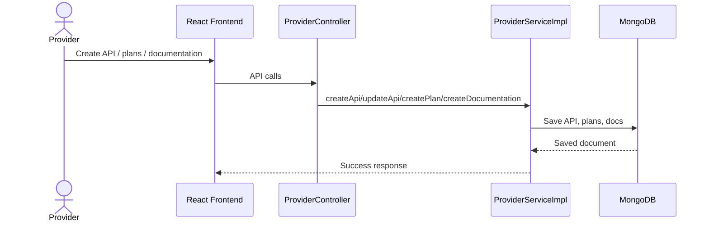
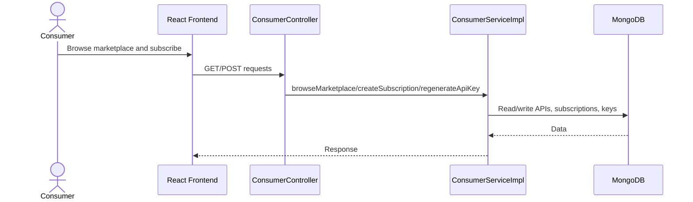
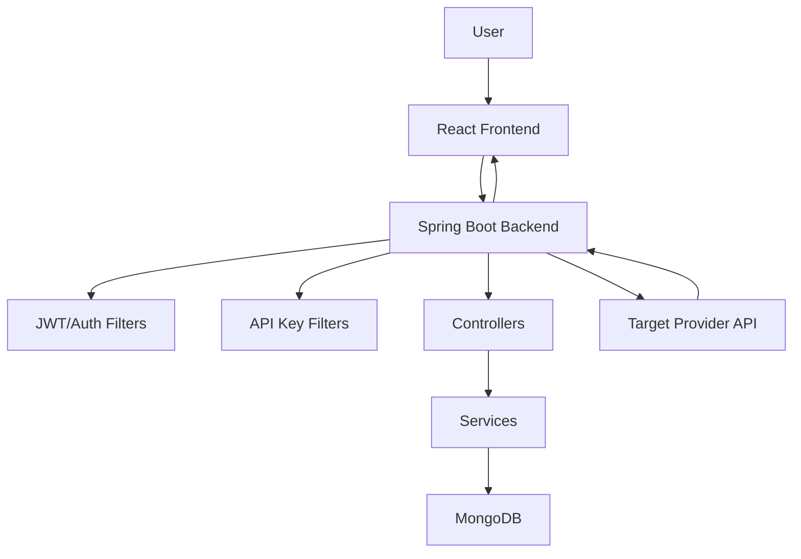
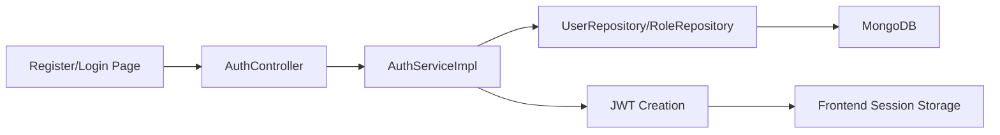
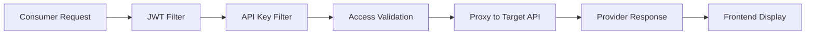

# Project Presentation Master Guide

## 1. Project Overview

- Project name: API Marketplace MVP
- One-line description: A Spring Boot-based API marketplace where providers publish APIs, consumers subscribe and obtain API keys, and requests are authorized and proxied to target APIs.
- Short project description: This project combines an API marketplace, subscription management, JWT-based authentication, API-key-based access control, request proxying, usage tracking, and a React frontend. It is designed to let providers expose their APIs and consumers consume them securely through a unified platform.
- Problem being solved: Many APIs are hard to discover, manage, and consume in a controlled way. This system centralizes API exposure, access control, billing/subscription logic, documentation, and request execution.
- Why the project is needed: It gives providers a consistent way to publish APIs and gives consumers a secure, visible, and documented way to use them.
- Main objective: Build a working marketplace where APIs can be listed, subscribed to, consumed securely, and monitored.
- Target users:
  - Providers who want to publish and manage APIs
  - Consumers who want to discover and use APIs
  - Admins who approve and supervise the platform
- Key technologies used:
  - Backend: Spring Boot 3.3.3, Java 21, Spring Security, Spring Web, Spring Data MongoDB
  - Frontend: React + Vite + Material UI + React Router
  - Database: MongoDB
  - Authentication/security: JWT, BCrypt, API key authentication, role-based access control
  - External services: Razorpay for payment/order verification, SMTP email notifications
- Backend technology: Java, Spring Boot, Spring Security, MongoDB, REST APIs
- Frontend technology: React, Vite, Material UI, Axios
- Database: MongoDB with collections such as users, roles, apis, subscriptions, api_keys, usage_logs, api_documentation, subscription_plans
- Authentication/security technologies: JWT (Bearer token), API keys, BCrypt password encoding, Spring Security filters, role constraints
- External APIs/services: Provider target APIs, Razorpay, SMTP email notifications
- Major modules:
  - Authentication and user management
  - Provider API management
  - Consumer marketplace and subscriptions
  - API key management
  - API request proxy/execution
  - Admin approval and oversight

---

## 2. Problem Statement

The platform addresses the need for a secure, manageable API marketplace where:

- Providers can publish APIs and define subscription plans
- Consumers can browse APIs and subscribe to them
- Access is controlled using both JWT and API keys
- Requests are forwarded to target provider APIs while keeping usage logs and rate limiting in place
- Admins can review and approve API listings and users

---

## 3. Objectives

1. Create a secure API marketplace MVP.
2. Support three user roles: ADMIN, PROVIDER, and CONSUMER.
3. Allow providers to create and manage APIs and plans.
4. Allow consumers to browse APIs, subscribe, and receive API keys.
5. Enforce authentication and authorization for protected routes.
6. Proxy consumer requests to provider base URLs while enforcing API-key-based access decisions.
7. Track usage and provide documentation for subscribed APIs.

---

## 4. Technology Stack

### Backend
- Java 21
- Spring Boot 3.3.3
- Spring Security
- Spring Web
- Spring Data MongoDB
- Lombok
- MapStruct
- JWT (jjwt)
- Springdoc OpenAPI / Swagger UI
- Razorpay Java SDK

### Frontend
- React
- Vite
- Material UI
- React Router
- Axios
- React Toastify

### Database
- MongoDB
- Collections created and used by the application

### Dev/Deployment support
- Maven wrapper
- Docker Compose support for local services and environment configuration

---

## 5. System Architecture

The system follows a layered architecture:

```text
User
↓
React Frontend
↓
Spring Boot REST API
↓
Security Layer (JWT + API Key Filters)
↓
Controller Layer
↓
Service Layer
↓
Repository Layer
↓
MongoDB
↓
Target Provider API (via proxy)
↓
Response returned to frontend
```

### Architecture Components

- Frontend: React application that handles login, registration, marketplace browsing, subscription management, API key management, provider dashboards, and admin dashboards.
- Backend: Spring Boot REST API that exposes controllers for authentication, providers, consumers, admin, marketplace, and execution proxying.
- Controllers: Receive HTTP requests and delegate to service layer.
- Services: Contain business logic, authentication, subscription creation, API key creation, proxying, usage tracking, and notification logic.
- Repositories: Use Spring Data MongoDB to interact with collections.
- Security layer:
  - JWT authentication filter extracts and validates bearer tokens.
  - API key filter extracts X-API-Key and builds an authentication principal.
  - Security configuration defines public and protected routes.
- Database layer: Stores users, roles, APIs, plans, subscriptions, API keys, documentation, and usage logs.
- External APIs: The proxy service forwards requests to the provider’s configured base URL.
- Notifications: Email notifications are sent for registration, login, subscription events, and API key operations.

### Key backend classes
- AuthController: authentication endpoints
- ConsumerController: consumer marketplace/subscription/key APIs
- ProviderController: provider API CRUD and documentation APIs
- ProtectedApiController: executes proxied API requests
- SecurityConfig: configures Spring Security
- JwtAuthenticationFilter: handles JWT validation
- ApiKeyAuthenticationFilter: handles X-API-Key authentication
- JwtUtil: generates and validates JWTs
- ApiKeyConsumptionServiceImpl: validates API-key-based access for execution requests
- ApiProxyServiceImpl: forwards requests to provider base URLs
- ConsumerServiceImpl: marketplace browsing, subscriptions, API keys, usage summaries
- ProviderServiceImpl: provider API and documentation management

---

## 6. Complete User Flow

A normal user journey in the system looks like this:

1. User opens the frontend application.
2. User registers or logs in.
3. Backend validates the credentials and returns a JWT.
4. Frontend stores the JWT and uses it in subsequent requests.
5. Depending on role, the user is routed to one of the dashboards:
   - ADMIN dashboard
   - PROVIDER dashboard
   - CONSUMER dashboard
6. A consumer browses the marketplace and views API details.
7. The consumer chooses a subscription plan and creates a subscription.
8. The system creates a subscription and, when applicable, generates or renews an API key.
9. The consumer sends a request to the execution endpoint using the JWT and API key.
10. Backend validates the JWT, validates the API key, checks the subscription/API status, and checks rate limits.
11. The backend forwards the request to the provider’s target API.
12. The provider API returns a response.
13. The backend passes the response back to the frontend.
14. The frontend displays the result to the user.

---

## 7. Authentication Flow

### Registration

```text
User
↓
POST /api/auth/register
↓
AuthController.register()
↓
AuthServiceImpl.register()
↓
Password encoded with BCrypt
↓
Role assigned
↓
User saved in MongoDB
↓
JWT generated and returned
```

### Login

```text
User
↓
POST /api/auth/login
↓
AuthController.login()
↓
AuthServiceImpl.login()
↓
Credentials validated
↓
JWT generated
↓
Frontend stores token
```

### Actual implementation details
- Register endpoint: POST /api/auth/register
- Login endpoint: POST /api/auth/login
- Current user endpoint: GET /api/auth/me
- Request body for register: fullName, email, password, role
- Request body for login: email, password
- Password hashing: BCryptPasswordEncoder
- JWT generation: JwtUtil.generateToken(username, role)
- User role is taken from the role collection and normalized to ADMIN, PROVIDER, or CONSUMER
- Authentication uses Spring Security and a stateless session policy

---

## 8. JWT Flow

JWT is used to identify the logged-in user after login.

```text
Client
↓
Authorization: Bearer <JWT>
↓
JwtAuthenticationFilter
↓
JwtUtil.isTokenValid()
↓
JwtUtil.extractUsername()
↓
SecurityContext populated
↓
Controller receives authenticated request
```

### Actual implementation details
- JWT is extracted from the Authorization header.
- The filter class is JwtAuthenticationFilter.
- The token is validated by JwtUtil.isTokenValid().
- The username is extracted using JwtUtil.extractUsername().
- The role is extracted using JwtUtil.extractRole().
- The authentication object is created with UsernamePasswordAuthenticationToken.
- The token is signed with the secret configured in application.properties.
- Expiration is controlled by jwt.expiration-ms and defaults to 86400000 milliseconds (24 hours).
- If the token is missing or invalid, the request is treated as unauthenticated and the security layer rejects it.

---

## 9. API Key Flow

The API key flow is used for API consumption and access validation.

```text
Consumer
↓
Subscribe to API
↓
ConsumerServiceImpl.createSubscription()
↓
ConsumerServiceImpl.regenerateApiKey()
↓
ApiKey stored in MongoDB with hash + prefix
↓
Consumer sends X-API-Key header
↓
ApiKeyAuthenticationFilter
↓
ApiKeyPrincipal created
↓
ProtectedApiController executes request
```

### Actual implementation details
- API keys are generated in ConsumerServiceImpl.generateApiKey().
- A raw key is returned once at creation/regeneration time.
- The key is hashed before storage using SHA-256 and Base64 encoding.
- The entity is ApiKey and it is stored in the api_keys collection.
- The key is linked to:
  - a Subscription
  - a Consumer/User
  - an Api
- The API key status is tracked using ApiKeyStatus (ACTIVE, REVOKED, etc.).
- The filter ApiKeyAuthenticationFilter checks the X-API-Key header and sets an authentication principal only if the key is active and the subscription is active and not expired.

---

## 10. JWT + API Key Authorization

This project uses both mechanisms in combination for API execution.

### Difference
- JWT answers: “Who is this user?”
- API key answers: “Does this user have access to this specific API and subscription?”

### Combined flow

```text
Client request
↓
JWT validation
↓
API key validation
↓
Subscription/API authorization check
↓
Rate limit check
↓
Request forwarded to target provider API
```

### Actual behavior in the code
- JWT authentication is handled by JwtAuthenticationFilter.
- API key authentication is handled by ApiKeyAuthenticationFilter.
- The protected execution endpoint is /api/marketplace/apis/{apiId}/execute and its variants.
- The controller ProtectedApiController first calls ApiKeyConsumptionServiceImpl.validateRequest(authentication, request).
- The service checks:
  - whether an ApiKeyPrincipal exists
  - whether the key exists
  - whether the key is active
  - whether the subscription is active and not expired
  - whether the API exists
  - whether the requested API ID matches the key’s API
  - whether rate limits are exceeded

If all checks pass, the request is forwarded. If any fail, the system returns a structured error response.

---

## 11. API Marketplace Flow

### Marketplace browsing
- Consumers call GET /api/consumer/marketplace/apis or GET /api/marketplace/apis.
- The service ConsumerServiceImpl.browseMarketplace() filters APIs based on search, category, pricing, and sort.
- The frontend MarketplacePage renders the list.

### Marketplace detail page
- Consumer calls GET /api/consumer/marketplace/apis/{id} or GET /api/marketplace/apis/{id}.
- The service returns API metadata, category, provider data, and whether documentation exists.

### Subscription and access
- Consumer selects a plan and creates a subscription through POST /api/consumer/subscriptions.
- The consumer generates a key through POST /api/consumer/subscriptions/{subscriptionId}/api-key/regenerate.
- The API key becomes the credential used for execution requests.

---

## 12. API Provider Flow

A provider uses the system to publish and manage APIs.

### Provider actions
1. Provider logs in with provider role.
2. Provider accesses /api/provider/dashboard.
3. Provider creates or updates APIs through /api/provider/apis.
4. Provider defines subscription plans through /api/provider/apis/{id}/plans.
5. Provider can add documentation through /api/provider/apis/{id}/documentation.
6. Provider can submit, archive, or delete APIs.
7. Provider can view subscribers for an API.

### Backend classes involved
- ProviderController
- ProviderServiceImpl
- ApiRepository
- SubscriptionPlanRepository
- ApiDocumentationRepository
- SubscriptionRepository

### Important provider data stored
- API name, description, base URL, category, version, authenticationType, rate limit, status
- Provider profile information
- Subscription plans and documentation

---

## 13. API Consumer Flow

A consumer uses the system as follows:

1. Register or login as CONSUMER.
2. Browse the marketplace.
3. Open an API details page.
4. Choose a plan and create a subscription.
5. Receive an API key.
6. Use the API key and JWT for protected execution.
7. Call the execution endpoint.
8. Receive the provider API response in the frontend.

### Backend classes involved
- ConsumerController
- ConsumerServiceImpl
- ApiKeyRepository
- SubscriptionRepository
- UsageLogRepository

---

## 14. API Request End-to-End Flow

This is the core of the project.

### What happens when a user clicks “Send Request” or calls the execution endpoint?

```text
Client / Browser
↓
HTTP Request to /api/marketplace/apis/{apiId}/execute...
↓
Security filters in SecurityConfig
↓
JwtAuthenticationFilter validates bearer token
↓
ApiKeyAuthenticationFilter validates X-API-Key
↓
ProtectedApiController.executeProtectedApi(...)
↓
ApiKeyConsumptionServiceImpl.validateRequest(...)
↓
Checks: API key exists, active, subscription active, API exists, rate limit, API match
↓
ApiProxyServiceImpl.proxyRequest(...)
↓
Builds target URL from provider baseUrl + request path/query
↓
Forwards method/body/headers (with sensitive headers removed)
↓
Target provider API responds
↓
Backend returns the provider response to client
↓
Frontend renders the result
```

### Step-by-step details

| Step | What happens | Class / Method | Endpoint / Method | Notes |
|---|---|---|---|---|
| 1 | Browser sends request | Frontend React | /api/marketplace/apis/{apiId}/execute... | Usually from a consumer dashboard or documentation experience |
| 2 | Security chain runs | SecurityConfig | All protected routes | JWT and API key filters are applied |
| 3 | JWT Bearer token is processed | JwtAuthenticationFilter.doFilterInternal() | Authorization: Bearer | Sets authentication if valid |
| 4 | X-API-Key is processed | ApiKeyAuthenticationFilter.doFilterInternal() | X-API-Key | Creates ApiKeyPrincipal |
| 5 | Controller receives the request | ProtectedApiController.executeProtectedApi() | GET/POST/PUT/PATCH/DELETE on /api/marketplace/apis/{apiId}/execute... | Handles all supported methods |
| 6 | Access decision is made | ApiKeyConsumptionServiceImpl.validateRequest() | Internal service | Validates API key, subscription, API, rate limit |
| 7 | Usage is logged | ApiKeyConsumptionServiceImpl.recordUsage() | usage_logs collection | Stores request metadata |
| 8 | Request is forwarded | ApiProxyServiceImpl.proxyRequest() | Internal service | Builds target URI and forwards body |
| 9 | Response is returned | ApiProxyServiceImpl | Provider API | Returns response bytes and headers |
| 10 | Response is reshaped | ProtectedApiController | Backend response | Removes sensitive headers and forwards result |

### Important validations performed
- JWT must be present and valid if the security context is not already set.
- X-API-Key must be present and correspond to an active key.
- The subscription must be active and unexpired.
- The API must be present and approved.
- The requested path API ID must match the API tied to the key.
- Rate limits are checked using a rate_limit_counters collection and the subscription plan/API rate limit.

### Important response behaviors
- If validation fails, the backend returns an ErrorResponse with a status such as 401, 403, 404, 429, or 502.
- If the downstream provider API is unreachable, the controller returns 502 Bad Gateway with a PROXY_ERROR payload.

---

## 15. GET Request Flow

GET requests are supported for list/detail and proxy execution.

### Example 1: Browse marketplace
- Endpoint: GET /api/consumer/marketplace/apis
- Auth: JWT required because the endpoint is behind consumer role protection
- Controller: ConsumerController.browseMarketplace()
- Service: ConsumerServiceImpl.browseMarketplace()
- Response: paged list of marketplace APIs

### Example 2: Execute a provider API via proxy
- Endpoint: GET /api/marketplace/apis/{apiId}/execute/endpoint/path
- Auth: JWT + X-API-Key
- Controller: ProtectedApiController.executeProtectedApi()
- Service: ApiKeyConsumptionServiceImpl.validateRequest() and ApiProxyServiceImpl.proxyRequest()
- Headers: Authorization: Bearer ..., X-API-Key: ...
- Behavior: The backend reconstructs the target path and forwards the request to the provider base URL.

---

## 16. POST Request Flow

POST is supported by the current implementation.

### Supported POST use cases
- POST /api/auth/register
- POST /api/auth/login
- POST /api/consumer/subscriptions
- POST /api/consumer/profile/upload
- POST /api/consumer/subscriptions/{subscriptionId}/api-key/regenerate
- POST /api/consumer/payments/create-order
- POST /api/consumer/payments/verify
- POST /api/marketplace/apis/{apiId}/execute... for proxying a POST request to the target provider API

### Example POST execution flow
```text
Client
↓
POST /api/marketplace/apis/{apiId}/execute/your/path
↓
ProtectedApiController
↓
Validate JWT + API key
↓
Read request body
↓
Forward to target API base URL + path
↓
Return provider response
```

### Important note
POST is not just for form uploads; it is also used for proxy execution of provider APIs.

---

## 17. Other HTTP Methods

### PUT
- Example: PUT /api/consumer/profile
- Used to update consumer profile
- Auth: JWT required
- Controller: ConsumerController.updateProfile()

### PATCH
- Example: PATCH /api/consumer/subscriptions/{id}/cancel
- Used to cancel subscriptions
- Auth: JWT required
- Controller: ConsumerController.cancelSubscription()

### DELETE
- Example: DELETE /api/consumer/api-keys/{id}
- Used to revoke an API key
- Auth: JWT required
- Controller: ConsumerController.revokeApiKey()

### Proxy execution methods
The protected execution endpoint accepts GET, POST, PUT, PATCH, and DELETE through a shared mapping in ProtectedApiController. This is one of the most important features of the project.

---

## 18. Database Architecture

The application uses MongoDB collections and document references.

| Entity / Collection | Purpose | Important fields | Relationships |
|---|---|---|---|
| users | Stores users | id, fullName, email, password, enabled, role, approvalStatus, firstLoginAt | Linked to roles and profiles |
| roles | Stores role definitions | id, name | Used by users |
| apis | Stores published APIs | id, providerId, name, description, baseUrl, categoryId, authenticationType, rateLimit, status | Belongs to a provider |
| subscription_plans | Stores subscription plans | id, apiId, planName, price, billingCycle, requestLimit, active | Belongs to an API |
| subscriptions | Stores consumer subscriptions | id, consumer, api, subscriptionPlan, status, price, expiresAt | Links consumer to API and plan |
| api_keys | Stores API keys | id, subscription, consumer, api, keyHash, keyPrefix, status, createdAt, lastUsedAt, revokedAt | Linked to subscription, consumer, API |
| usage_logs | Stores request usage logs | id, consumer, api, subscription, endpoint, httpMethod, statusCode, responseTimeMs | Supports analytics and monitoring |
| api_documentation | Stores docs for APIs | id, apiId, authenticationGuide, baseEndpoint, headers, requestExample, responseExample, markdown | Linked to API |
| categories | Stores categories | id, name, description, icon, active | Used for marketplace filtering |
| provider_profiles / consumer_profiles | Stores profile details | userId, companyName, website, etc. | Related to users |

### Database flow
```text
Frontend
↓
Controller
↓
Service
↓
Repository
↓
MongoDB
```

---

## 19. Important Database Relationships

```text
User
├── has a Role
├── can be a Provider
├── can be a Consumer
├── can own APIs
├── can create subscriptions
├── can own API keys
└── can generate usage logs

Api
├── belongs to a Provider
├── has many SubscriptionPlans
├── has many Subscriptions
├── has many API keys
└── may have documentation

Subscription
├── belongs to one Consumer
├── belongs to one Api
├── uses one SubscriptionPlan
└── generates many API keys and usage logs
```

---

## 20. Frontend Flow

### Main frontend screens

| Screen | Purpose | Key API calls | User actions |
|---|---|---|---|
| LandingPage | Welcome/introduction | None | Navigate to login/register |
| LoginPage | Sign in | POST /api/auth/login | Submit credentials |
| RegisterPage | Create account | POST /api/auth/register | Submit profile and role |
| MarketplacePage | Browse APIs | GET /api/marketplace/apis or /api/consumer/marketplace/apis | Search/filter/select API |
| ApiDetailsPage | View API details and plans | GET API details + plans | Choose a plan |
| CheckoutPage | Create or activate subscription | POST /api/consumer/subscriptions, POST /api/consumer/payments/create-order, POST /api/consumer/payments/verify | Complete checkout |
| SubscriptionsPage | Manage subscriptions | GET /api/consumer/subscriptions | View and manage subscription |
| DocumentationPage | View API documentation | GET /api/consumer/subscriptions/{id}/documentation | Read docs and examples |
| ApiKeysPage | Show and manage API keys | GET /api/consumer/api-keys, POST regenerate, DELETE revoke | Create/revoke/regenerate keys |
| UsagePage | Display usage metrics | GET /api/consumer/usage | Review request history |
| Provider dashboard pages | Manage APIs | Provider-specific CRUD endpoints | Create/update/delete APIs |
| Admin pages | Review users and APIs | Admin endpoints | Approve/reject content |

### Frontend route flow
```text
Login/Register
↓
Dashboard
↓
Marketplace
↓
API Details
↓
Subscription/Checkout
↓
API Keys / Documentation / Usage
```

---

## 21. Error Handling Flow

The backend uses a global exception handler and structured error responses.

### Invalid JWT
```text
Request
↓
JwtAuthenticationFilter
↓
Invalid/absent token
↓
401 Unauthorized / authentication error
```

### Invalid API Key
```text
Request
↓
ApiKeyAuthenticationFilter
↓
No valid active key found
↓
401 Unauthorized or 403 Forbidden
```

### API not found
```text
Request
↓
ApiKeyConsumptionServiceImpl
↓
API missing or mismatched
↓
404 or 403
```

### Target API failure
```text
Request
↓
Proxy service
↓
Downstream API unreachable
↓
502 Bad Gateway with PROXY_ERROR payload
```

### Validation errors
- MethodArgumentNotValidException returns 400 with field-level validation details.

### Important exception classes
- GlobalExceptionHandler
- InvalidCredentialsException
- EmailAlreadyExistsException
- ResourceNotFoundException
- UnauthorizedResourceAccessException
- ApiKeyNotFoundException

---

## 22. Security Flow

### Implemented security mechanisms
- Spring Security enabled with SecurityConfig
- Stateless session management
- JWT bearer authentication
- API key-based authentication for proxy execution
- BCrypt password encoding
- Role-based access control via @PreAuthorize and security filters
- Public endpoints for auth and docs
- Protected endpoints for consumer/provider/admin features

### Protected routes
- /api/consumer/** requires consumer role
- /api/provider/** requires provider role
- /api/admin/** requires admin role
- /api/marketplace/apis/{apiId}/execute... requires valid JWT + API key

### Public routes
- /api/auth/**
- /swagger-ui/**
- /v3/api-docs/**
- /uploads/**

---

## 23. Complete API Inventory

| Method | Endpoint | Purpose | Auth | API Key | Body | Response |
|---|---|---|---|---|---|---|
| POST | /api/auth/register | Register new user | No | No | fullName, email, password, role | JWT login response |
| POST | /api/auth/login | Login | No | No | email, password | JWT and user info |
| GET | /api/auth/me | Get current user | JWT | No | None | Current user profile |
| GET | /api/marketplace/apis | Browse marketplace | Optional/varies | No | Query params | Paged list of APIs |
| GET | /api/marketplace/apis/{id} | View API details | Optional/varies | No | None | API details |
| GET | /api/marketplace/apis/{apiId}/plans | List plans | Optional/varies | No | None | List of plans |
| GET/POST/PUT/PATCH/DELETE | /api/marketplace/apis/{apiId}/execute... | Execute proxied API request | JWT | Yes | Request body for non-GET methods | Provider response |
| GET | /api/consumer/profile | Get consumer profile | JWT + CONSUMER | No | None | Consumer profile |
| PUT | /api/consumer/profile | Update profile | JWT + CONSUMER | No | Profile data | Updated profile |
| POST | /api/consumer/subscriptions | Create subscription | JWT + CONSUMER | No | apiId, planId | Subscription response |
| GET | /api/consumer/api-keys | List API keys | JWT + CONSUMER | No | None | List of API keys |
| POST | /api/consumer/subscriptions/{id}/api-key/regenerate | Regenerate API key | JWT + CONSUMER | No | None | New raw API key |
| DELETE | /api/consumer/api-keys/{id} | Revoke API key | JWT + CONSUMER | No | None | No content |
| GET | /api/consumer/usage | Usage summary | JWT + CONSUMER | No | Query params | Usage metrics |
| GET | /api/provider/apis | List provider APIs | JWT + PROVIDER | No | Query params | API list |
| POST | /api/provider/apis | Create API | JWT + PROVIDER | No | API payload | Created API |
| PUT | /api/provider/apis/{id} | Update API | JWT + PROVIDER | No | API payload | Updated API |
| DELETE | /api/provider/apis/{id} | Delete API | JWT + PROVIDER | No | None | No content |
| GET | /api/admin/users | List users | JWT + ADMIN | No | None | User list |
| PUT | /api/admin/users/{id}/status | Update user status | JWT + ADMIN | No | enabled flag | User response |
| GET | /api/admin/apis | View all APIs | JWT + ADMIN | No | None | API list |
| PUT | /api/admin/apis/{id}/approve | Approve API | JWT + ADMIN | No | None | API response |
| POST | /api/consumer/payments/create-order | Create Razorpay order | JWT + CONSUMER | No | subscriptionId | Razorpay order |
| POST | /api/consumer/payments/verify | Verify payment | JWT + CONSUMER | No | verification payload | Activation response |

---

## 24. Important Classes

| Class | Layer | Responsibility |
|---|---|---|
| AuthController | Controller | Handles register/login/me |
| ConsumerController | Controller | Consumer marketplace, subscriptions, keys, usage |
| ProviderController | Controller | Provider API and documentation management |
| ProtectedApiController | Controller | Proxies protected requests to provider APIs |
| SecurityConfig | Configuration | Configures Spring Security filters and route access |
| JwtAuthenticationFilter | Filter | Validates JWT and populates SecurityContext |
| ApiKeyAuthenticationFilter | Filter | Validates X-API-Key and creates ApiKeyPrincipal |
| JwtUtil | Security utility | Signs and validates JWTs |
| AuthServiceImpl | Service | Registers/logs in users and creates JWT-based responses |
| ConsumerServiceImpl | Service | Marketplace browsing, subscriptions, key issuance, usage reporting |
| ProviderServiceImpl | Service | Provider API CRUD, docs, plans, approvals |
| ApiKeyConsumptionServiceImpl | Service | Validates API key access and rate limits |
| ApiProxyServiceImpl | Service | Forwards requests to provider APIs |
| ApiKeyRepository | Repository | Accesses API key data |
| SubscriptionRepository | Repository | Accesses subscriptions |
| ApiRepository | Repository | Accesses published APIs |
| UsageLogRepository | Repository | Logs usage data |
| GlobalExceptionHandler | Exception handling | Converts backend errors into standardized responses |

---

## 25. Important Code Logic

These are the strongest code sections to show during a presentation.

| File | Class / Method | What it does | Why it matters |
|---|---|---|---|
| src/main/java/com/marketplace/filter/JwtAuthenticationFilter.java | doFilterInternal() | Extracts Bearer token and populates authentication | Core JWT authentication flow |
| src/main/java/com/marketplace/security/jwt/JwtUtil.java | generateToken()/isTokenValid() | Creates and validates JWTs | Shows how tokens are issued and checked |
| src/main/java/com/marketplace/filter/ApiKeyAuthenticationFilter.java | doFilterInternal() | Extracts X-API-Key and creates ApiKeyPrincipal | Core API key execution flow |
| src/main/java/com/marketplace/service/impl/ApiKeyConsumptionServiceImpl.java | validateRequest() | Validates subscription, API, key, rate limit | Central gateway decision logic |
| src/main/java/com/marketplace/controller/ProtectedApiController.java | executeProtectedApi() | Handles request execution and returns downstream response | Main API proxy entry point |
| src/main/java/com/marketplace/service/impl/ApiProxyServiceImpl.java | proxyRequest() | Builds target URL and forwards request | Essential request forwarding logic |
| src/main/java/com/marketplace/service/impl/AuthServiceImpl.java | login()/register() | Creates and validates users | Authentication business logic |
| src/main/java/com/marketplace/service/impl/ConsumerServiceImpl.java | createSubscription()/regenerateApiKey() | Creates subscriptions and keys | Marketplace consumer lifecycle |
| src/main/java/com/marketplace/service/impl/ProviderServiceImpl.java | createApi()/submitApi() | Publishes and approves APIs | Provider management lifecycle |
| src/main/java/com/marketplace/exception/GlobalExceptionHandler.java | exception handlers | Standardizes error responses | Shows robust error handling |

---

## 26. Real API Examples

### Login example

Request:
```http
POST /api/auth/login
Content-Type: application/json

{
  "email": "consumer@example.com",
  "password": "password123"
}
```

Response:
```json
{
  "token": "<jwt>",
  "type": "Bearer",
  "role": "CONSUMER",
  "userId": "...",
  "fullName": "..."
}
```

### Protected execution example

Request:
```http
GET /api/marketplace/apis/{apiId}/execute/weather?city=Delhi
Authorization: Bearer <jwt>
X-API-Key: <api-key>
```

Internal behavior:
1. JWT is validated.
2. API key is validated.
3. Subscription and rate limit are checked.
4. Request is forwarded to the provider’s base URL.
5. Response is returned to the frontend.

---

## 27. Sequence Diagrams

### Login flow



### API request execution flow



### Provider flow



### Consumer flow



---

## 28. System Flow Diagrams

### Overall architecture



### Registration and login



### API execution



---

## 29. PPT Slide-by-Slide Blueprint

### Slide 1 — Title
- Purpose: Introduce the project.
- Content: API Marketplace MVP, team/project name, short tagline.
- Visual: App dashboard screenshot or architecture diagram.

### Slide 2 — Problem Statement
- Purpose: Explain the problem.
- Content: API discovery, security, access control, subscription management.
- Visual: Problem illustration.

### Slide 3 — Objectives
- Purpose: Explain what the platform aims to solve.
- Content: Publish APIs, subscribe, secure access, track usage.

### Slide 4 — Technology Stack
- Purpose: Show the stack used.
- Content: Java, Spring Boot, MongoDB, React, JWT, API keys, Razorpay.

### Slide 5 — Architecture Overview
- Purpose: Show system layers.
- Content: Frontend → Backend → Security → MongoDB → Provider APIs.
- Visual: Mermaid architecture diagram.

### Slide 6 — User Roles
- Purpose: Show who uses the system.
- Content: Admin, Provider, Consumer.

### Slide 7 — Authentication & JWT
- Purpose: Explain sign-in and token-based access.
- Content: Register/login flow, JWT generation, Bearer token usage.

### Slide 8 — API Key & Authorization
- Purpose: Explain the second layer of access control.
- Content: X-API-Key, subscription validation, rate limits.

### Slide 9 — Marketplace Flow
- Purpose: Explain how APIs are discovered and subscribed to.
- Content: Browse APIs, choose plan, create subscription, get key.

### Slide 10 — API Provider Flow
- Purpose: Explain how providers manage APIs.
- Content: Create API, create plans, add docs, submit/approve lifecycle.

### Slide 11 — Request Execution Flow
- Purpose: Explain the heart of the system.
- Content: JWT + API key validation → proxy → target API → response.
- Visual: Detailed sequence diagram.

### Slide 12 — Database Design
- Purpose: Show data model.
- Content: users, apis, subscriptions, api_keys, usage_logs, documentation.

### Slide 13 — Frontend Screens
- Purpose: Show user experience.
- Content: Marketplace, subscriptions, API keys, documentation, admin dashboards.

### Slide 14 — Error Handling & Security
- Purpose: Show resilience and protection.
- Content: 401/403/404/429/502 and security controls.

### Slide 15 — Key Features
- Purpose: Summarize value delivered.
- Content: Secure API marketplace, subscriptions, key management, usage tracking, docs, provider/admin modules.

### Slide 16 — Challenges & Future Scope
- Purpose: Show learnings and next steps.
- Content: rate limiting, analytics, richer gateway features, OAuth support, stronger admin controls.

---

## 30. Live Demo Script

### Demo flow
1. Open the landing page.
2. Register a new consumer account.
3. Log in and receive a JWT.
4. Browse the marketplace.
5. Open an API details page.
6. Choose a plan and create a subscription.
7. Regenerate or view the generated API key.
8. Open the documentation page for the subscription.
9. Trigger the protected execution endpoint using the JWT and API key.
10. Show the backend validation steps in theory and explain how the proxy works.
11. Show the returned provider response in the UI.
12. Demonstrate an invalid or missing API key and show the error response.

### What to explain during demo
- What endpoint is called
- Which headers are used
- What backend classes process the request
- Which validations occur
- What response is returned

---

## 31. Code Sections to Show

If you want to impress the audience during the presentation, show these code sections:

1. JwtUtil — JWT signing/verification logic
2. JwtAuthenticationFilter — Bearer token extraction
3. ApiKeyAuthenticationFilter — X-API-Key verification
4. ApiKeyConsumptionServiceImpl — access decision and rate limit logic
5. ProtectedApiController — request routing and proxying entrypoint
6. ApiProxyServiceImpl — request forwarding to target provider API
7. ConsumerServiceImpl — subscription and API key creation
8. ProviderServiceImpl — API publication and management
9. SecurityConfig — route-level security configuration
10. GlobalExceptionHandler — centralized error handling

---

## 32. Technical Challenges

| Challenge | Solution | Implementation | Result |
|---|---|---|---|
| Authentication and authorization | Use JWT + role-based access | JwtAuthenticationFilter and SecurityConfig | Secure routes with user roles |
| API access control | Use API keys tied to subscriptions | ApiKeyAuthenticationFilter and ApiKeyConsumptionServiceImpl | Access is validated per subscription/API |
| Request forwarding | Proxy requests to provider base URLs | ApiProxyServiceImpl | Consumer requests reach target provider APIs |
| Rate limiting | Track requests using MongoDB counters | ApiKeyConsumptionServiceImpl.checkRateLimit() | Prevents abuse and overuse |
| Usage tracking | Log each request | UsageLog entity and usage logging service | Analytics and audit trail possible |
| Multi-role platform | Separate provider/consumer/admin paths | Role-based controllers and guards | Clean role separation |

---

## 33. Key Features

### Authentication Features
- User registration and login
- JWT-based session handling
- Role-based access control
- Password encoding using BCrypt

### API Marketplace Features
- Marketplace browsing and search
- API details and plan listing
- Consumer subscription flow

### API Management Features
- Provider API creation/update/delete
- Subscription plan management
- Documentation creation/update
- API status transitions (pending/approved/archived/rejected)

### API Consumption Features
- API key generation/regeneration/revocation
- Protected request execution
- Forwarding of GET/POST/PUT/PATCH/DELETE requests
- Usage tracking

### Security Features
- JWT validation
- API key validation
- Active subscription and expiry checks
- Rate limiting
- Standardized error handling

### Frontend Features
- Role-based dashboards
- Marketplace UI
- Subscription and key management pages
- Documentation page and usage dashboard

### Database Features
- MongoDB-backed persistence
- Document references for users, roles, APIs, subscriptions, API keys, and usage logs

---

## 34. Current Limitations

### Implemented
- JWT authentication
- API-key-based protected execution
- Marketplace browsing and subscriptions
- Provider API management
- Consumer API key management
- Admin review and control endpoints
- Usage logging

### Not currently implemented or limited
- Full enterprise gateway features like advanced analytics dashboards and quotas beyond basic rate limit tracking
- Full OAuth2 provider integration
- Advanced API versioning policy management
- Full payment lifecycle beyond integration hooks and activation flow
- A fully polished developer portal beyond documentation and key management

---

## 35. Future Scope

Realistic enhancements for the next phase:

- Rate limiting with more advanced quotas and burst handling
- API analytics and dashboards
- Subscription plan billing integration with richer payment workflows
- OAuth2 support for developers
- API versioning and lifecycle management
- Better gateway features such as caching, request transformation, and retries
- Monitoring and observability for proxy traffic
- Developer portal improvements and SDK generation

---

## 36. Final Project Story

A consumer wants to use an API that is published on the marketplace. The journey begins when the consumer logs in and receives a JWT. The user then browses APIs, selects one, subscribes, and receives an API key. When the consumer sends a request, the backend validates the JWT, validates the API key, checks whether the subscription is active, and then forwards the request to the provider’s target API. The provider response is returned to the consumer in the frontend. In this way, the project turns a simple API marketplace into a secure, managed, and observable API consumption platform.

---

## 37. Viva Questions and Answers

### Q1. What is this project about?
A. It is an API marketplace MVP where providers publish APIs and consumers subscribe to them, receive API keys, and execute requests through a secure backend proxy.

### Q2. What is the main architecture of the project?
A. The project uses a React frontend, Spring Boot backend, Spring Security, and MongoDB. The backend exposes REST endpoints, validates JWT and API keys, and proxies requests to external provider APIs.

### Q3. What is the role of Spring Boot here?
A. Spring Boot provides the REST API layer, dependency injection, controller/service structure, security integration, and communication with MongoDB.

### Q4. What is the difference between JWT and API key in this project?
A. JWT identifies the logged-in user. API key verifies access to a specific API subscription and is used in the protected execution flow.

### Q5. How is authentication implemented?
A. Authentication is implemented with Spring Security using JWT bearer tokens and BCrypt password hashing.

### Q6. How is authorization implemented?
A. Role-based authorization is implemented using Spring Security with provider, consumer, and admin role checks.

### Q7. Which endpoint is responsible for proxying API requests?
A. The protected execution endpoint is implemented in ProtectedApiController and forwards requests via ApiProxyServiceImpl.

### Q8. What happens when an API request is made?
A. The backend validates JWT and API key, checks subscription/API state and rate limits, forwards the request to the provider API, and returns the response.

### Q9. What database is used?
A. MongoDB is used.

### Q10. What are the important collections?
A. Users, roles, apis, subscription_plans, subscriptions, api_keys, usage_logs, api_documentation, categories, and profile collections.

### Q11. What is the purpose of the API key?
A. The API key links a consumer subscription to a specific API and is used to authorize protected execution requests.

### Q12. What error responses are common?
A. Common responses include 401 Unauthorized, 403 Forbidden, 404 Not Found, 429 Too Many Requests, and 502 Bad Gateway for proxy failures.

### Q13. What is the role of the frontend?
A. The frontend provides login, marketplace browsing, API details, subscriptions, API key management, documentation, and dashboards.

### Q14. What are the current limitations of the project?
A. The project is an MVP and does not yet include advanced gateway features, richer analytics, or a full enterprise-grade OAuth and billing platform.

### Q15. What is the biggest technical feature of the project?
A. The most important feature is the combined JWT + API key-based request execution pipeline that securely proxies a consumer request to a target provider API.
